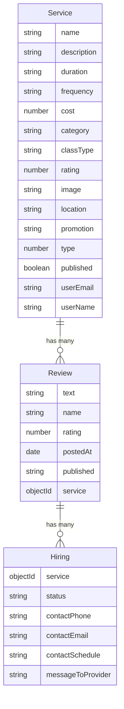

# ExpertEase Backend
Este es el backend para ExpertEase, una plataforma diseñada para conectar a expertos con quienes buscan conocimientos especializados. Utiliza MongoDB como base de datos y está alojado en Azure para permitir la colaboración y el acceso remoto.

## Base de Datos

Para tener un trabajo de equipo mas facil la base de datos se encuentra hosteada en Azure. Se puede trabajar con una conexion a una base local cambiando la string de conexion.

## Como correr

Se corre como una aplicacion comun de nodejs con el comando:

```javascript
npm install
npm run dev
```

### Diagrama de la base de datos (mermaid.js)

